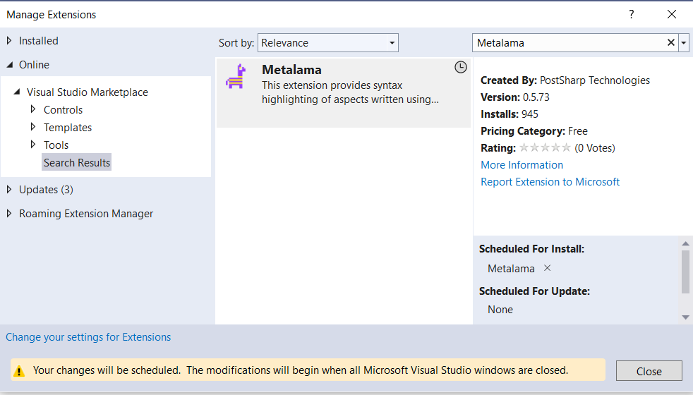

# Installing Metalama Tools for Visual Studio

Metalama Tools for Visual Studio is an extension to Visual Studio that helps you write aspects and understand your aspect-oriented code thanks to the following features:

* syntax highlighting of aspect codes (you will need it if you will be writing aspects later on),
* CodeLens additions,
* diffing your source code against the transformed code.

It is highly recommended that you download and install this extension for a better development experience. However, it is important to note that this extension is optional and Metalama will work without it too.

> [!WARNING]
> This Metalama Visual Studio Plugin requires Visual Studio 2022

1. Go to `Extensions` > `Manage Extensions`

    

2. Click on `Manage Extensions`. This will show the prompt like this

    

3. Type "Metalama" in the searchbox to the right of this prompt as shown below

    

4. Click the `Download` button to initiate the download

    

5. Once downloaded the extension will be ready to be installed as soon as all instances of visual studio is closed. Note that this is highlighted
at the bottom of this screen.

    

6. Give consent to install the extension

    As soon as you close Visual Studio, the installer will start installing the extension.

    

    The installation wizard will work independently and will require your consent at the following stage

    

7. Click "Modify" to complete installation

    To continue installing the extension, click on the `Modify` button. Once clicked the wizard will start installing the extension as shown below.

    

    Finally, when the wizard is done installing it will show the result as shown below.

    

## Checking that the extension is installed

To check that the installation had been successfull go to the same visual studio marketplace again via the Extensions menu and then try to locate "Metalama". If the installation had been successful you should see the following screenshot with a green tick mark on the top right indicating that indeed the extension have been installed correctly!

## Installing Metalama Command-Line Tool

Although you won't probably need it during your first days with Metalama, it's good to know what a Metalama command-line tool exists. For details, see <xref:dotnet-tool>. No worry, we will remind you  when it when you will need it.

