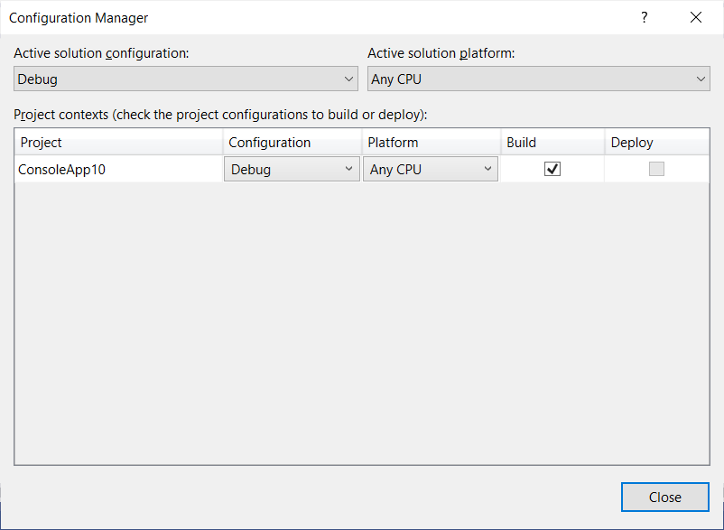
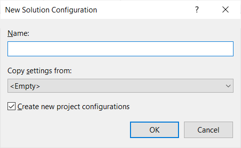
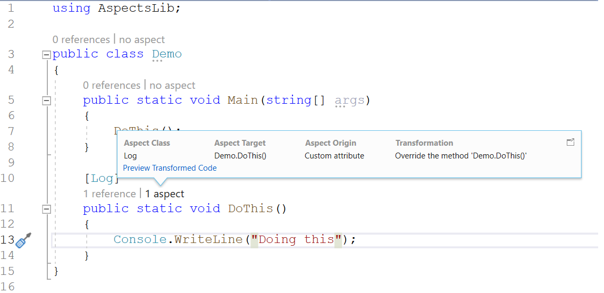
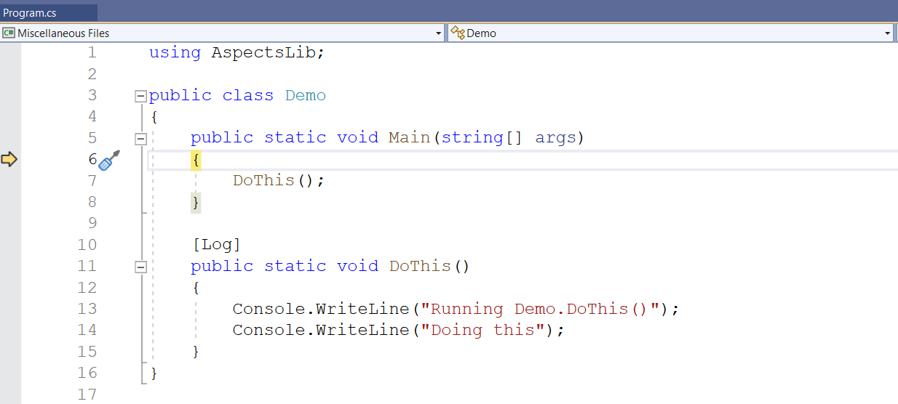
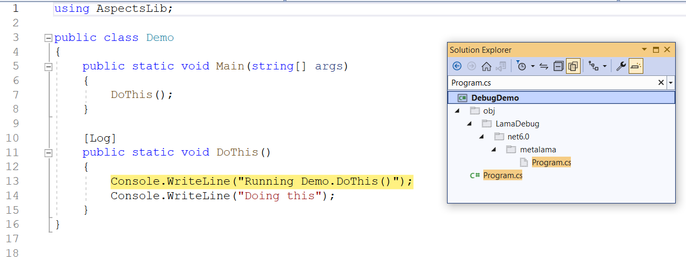

# Debugging aspect-oriented code

You have seen how aspects change your code and you have also seen the transformed code along with the original code side-by-side at <xref:preview-metalama-diff>

This section shows you how to debug the code using the Visual Studio debugger.

## Steps to debug aspect-oriented code

Follow these steps to debug your code with aspects.

### **Step 1** Open Build Configuration Manager

Click on the `Configuration Manager` from the debug setting dropdown as shown below

### **Step 2** Create a debug configuration called `LamaDebug`

The configuration manager will present the following dialog.

* Click to open the `Active solution configuration` dropdown.

* Click on `<New...>` to create a new debug configuration. This will bring the New dialog as shown below.

* Write the name **`LamaDebug`** and copy settings from `Debug` as shown below.

* Save this configuration by clicking `OK` button
* Now change the build configuration to `LamaDebug`

Now you are ready to debug your aspect-transformed code.

## Breakpoints and Step-Into

If you put a breakpoint in your code that is being modified by aspect, those breakpoints will not be hit. However, you can use `F11` to Step-Into as you do otherwise.

You can, however, put breakpoints into the transformed code. In the following sections, you shall learn how to locate the transformed code and how to debug this.

Consider the following code with the logging (`[Log]`) aspect

The logging aspect just adds a line at the beginning of the method that it intercepts. It just adds the name of the method that is intercepted. So when you step into this code by pressing `F11`, you should see the transformed code like this.

> [!NOTE]
> Note carefully that the line `Console.WriteLine("Running Demo.DoThis()")` is coming from the Logging aspect that is in the namespace `AspectLib`

To locate the transformed code click on the `Show all files` button as shown below.

Once it shows all files in your solution explorer, locate the file under `LamaDebug\net6.0\metalama`  as shown in the solution explorer screenshot below.

As you can see you can put a breakpoint on this transformed code and it will be hit because this is the code that got compiled.

## Debugging using step-in and forceful break

[!metalama-sample ~/code/DebugDemo/Program.cs]

> [!NOTE]
> When you debug this by Step-Into you shall see that the actual code being _debugged_ is the transformed code

## Breaking forcefully using `Debugger.Break`

You can put `Debugger.Break` to break the program forcefully. The following screenshot shows its usage.

> [!NOTE]
> Notice that it is the same code that you see before. You can add `Debugger.Break` to forcefully break the debugger at that location.
