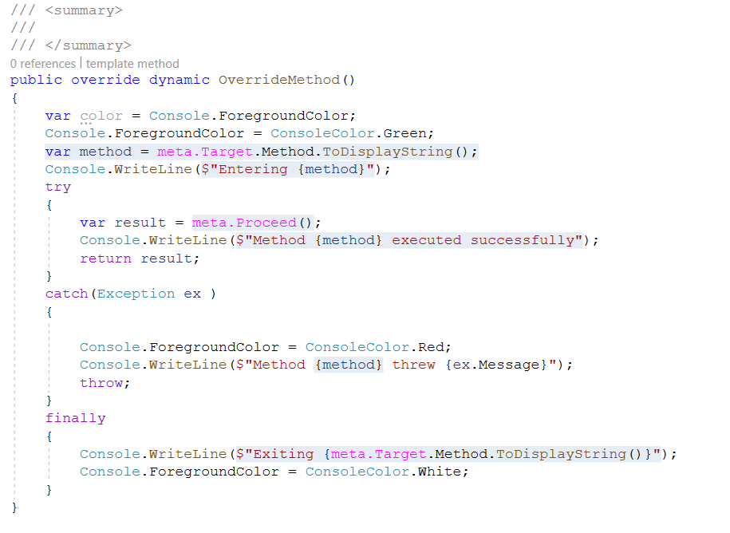

# Overriding Methods 

Metalama provides an abstract class called `OverrideMethodAspect` that makes it easier to author simple method aspects that can transform the target method.  

`OverrideMethodAspect` type has several methods to provide overriden functionaltity for different kind of methods. The following table shows them in a nutshell. 

|Situation| Override method | Overriden Signature 
|---------|-----------------|-------------- 
|Override all methods in a class | `OverrideMethod` | `public override  dynamic? OverrideMethod();`
|Override only methods that return `IEnumerable<T>`| `OverrideEnumerableMethod` | `public override IEnumerable<dynamic?> OverrideEnumerableMethod()` 
|Override only methods that return `IEnumerator<T>`| `OverrideEnumeratorMethod` | `public override IEnumerator<dynamic?> OverrideEnumeratorMethod()` 

## The `async` variations 
All of these methods have `Async` versions. So if you are trying to override a method that returns `IEnumerable<T>` asynchronously then you have to use `OverrideAsyncEnumerableMethod` The following table shows the async functions side by side. 

|Virtual Method  | Async Variation
|----------------|----------------
|`OverrideMethod`| `OverrideAsyncMethod` 
|`OverrideEnumerableMethod` | `OverrideAsyncEnumerableMethod` 
|`OverrideEnumeratorMethod` | `OverrideAsyncEnumeratorMethod`

> [!NOTE]
> Note that `OverrideMethod` is the only method required to use `OverrideMethodAspect`  abstract class in your aspect. Overriding other methods 


The following image shows how aspects modify your code and what is the connection between the different participating parts. 


Metalama Aspects can have expressions that can be either _compile time_ or _run time_ . In the design of aspects these two are mixed using the templating language T#. In the next few paragraphs we shall create a couple of simple method aspects and this will clarify how the templating language helps. 

> [!NOTE] 
> T# is **not** a programming language. It is a variation of C# that allows you to use _compile time_ and _runtime_ expressions in a single expression. 

## Syntax highlighting for _runtime_ and _compile-time_
Metalama Visual Studio plugin makes it easy to identify which parts of your aspect code will execute in compile time and which part will execute at runtime. The following screenshot shows an aspect. 



The grayed out parts will execute at compile time and the other parts will execute at runtime. One interesting line is 

```csharp
Console.WriteLine($"Entering {method}");
```
    
> [!TIP] 
> Note that the variable `method` will only be evaluated at runtime because the aspect can be applied on any method and the target method for which this code will get executed will only be known at runtime. 

Apart from this visual clue there are other ways to whether parts of the code will get executed in compile time or runtime. Hovering over the parts of the code, Visual Studio shows whether it will execute _runtime_ or _compile time_.  The following screenshot shows couple of examples from the code snippet above. 

Showing how Metalama shows the compile-time code parts when hovered.


Showing how Metalama shows the runtime code parts when hovered. 


## Going Deep on Method Logging aspect 
To log a method is to log its path or calls to it. In the aspect that we shall create the name of the target method and then use it to print statements to console. 

To create a simple Method logging aspect, 

**Step 1** Adding the type.

Add a class called `LogAttribute` to your project 

> [!NOTE]
> It is customary to create a type/class with the suffix `Attribute` 

**Step 2** Changing the type

Change the type public` and inherit from `OverrideMethodAspect` as shown below 

```csharp
 public class LogAttribute :  OverrideMethodAspect
 ```

**Step 3** Decide what you want to do when this method is called
You may just want to log to console, maybe in a different color. 

> [!NOTE]
> Realize that you just intercepted the method call. So you can do whatever you want to
do before that and then let the method do its own thing and maybe you can log at the end if it succeeds or fails 

Add the following code to the overridden `OverloadMethod` method as shown below. 

[!include[Simple Logging](../../../code/Metalama.Documentation.SampleCode.AspectFramework/SimpleLogging.cs)]

## Accessing different parts of a method from the aspect
The call `meta.Target.Method` gets the target method on which the aspect will need to be applied. `meta` is a special class. There are several properties of `meta` to get to different parts of a code. 

|meta property| Part of the code 
|-------------|-----------------
|`meta.Target.Method` | Gets to the target method of the aspect
|`meta.Target.Method.Name` |  Gets the name of the target method 
|`meta.Target.Method.IsGeneric` | Returns true if the method is generic
|`meta.Target.Method.IsVirtual` | Returns true if the method is virtual 
|`meta.Target.Method.Parameters` | Helps to access the parameters of the target method 
|`meta.Target.Method.ReturnType` | Helps to access the return type of the target method 
|...

These properties will be really useful to create more granular aspects. Actually there is a different topic to narrow down the scope of an aspect. It is called _Eligibility_. You shall learn about it in more detail in its own section 
 
## Logging different methods differently in a single aspect 

In the previous example you saw how we can create an aspect to transform the 

OverrideMethod

OverrideEnumerableMethod 


## Passing parameters to Aspects 
