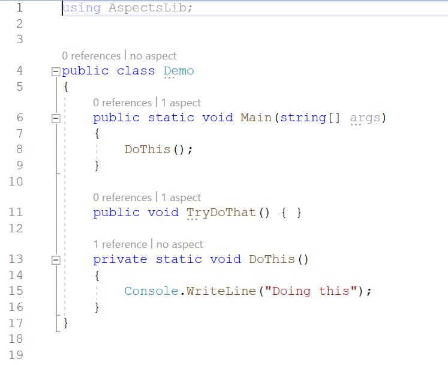
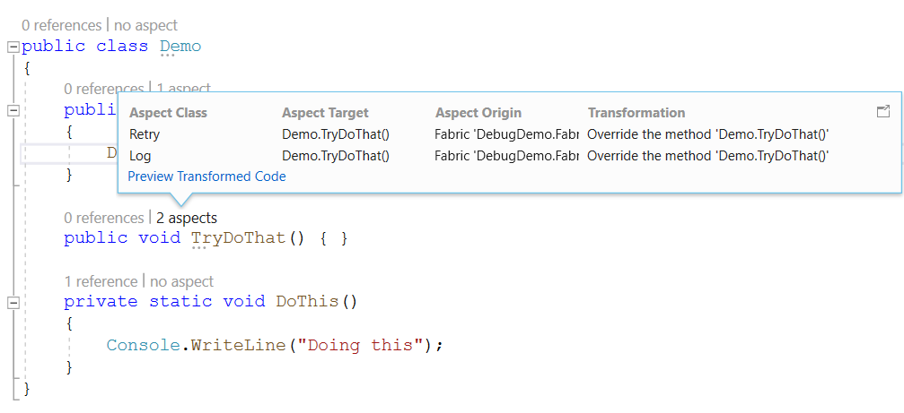

# Adding many aspects at once

In the previous section <xref:adding-aspects> you learnt how to apply aspects to a given target one at a time. However, you can use `Fabrics` to add aspects to your targets programmatically. 


## Fabrics
Fabrics are really helpful when you need to add aspects to different targets programmatically.  

There are three different types of fabrics available to alter a solution by adding aspects.

|Fabric type | Purpose 
|------------|---------
|Project Fabric| Used to add aspects to different targets in a given project.
|Namespace Fabric| Used to add aspects to different targets in a given namespace.
|Type Fabric | Used to add aspects to different members of a type.


## Adding aspect to all public methods of a type
In this section, you shall learn how to add `[Log]` attribute to all public methods of a given project. 

To add aspect to all public methods add the following Fabric to your project. 

[!code-csharp[](~\code\Metalama.Documentation.QuickStart.Fabrics\Fabric.cs)]


> [!NOTE]
> Fabrics need not be applied. They are triggered because of their presence in the project. 

The following screenshot shows aspect application of this Fabric across all methods in the `Program.cs` file 



> [!NOTE]
> Note that although there is no explicit attribute on the public methods of this type, you can see that all public methods `Main` and `TryDoThat` got the aspect applied.  

## Viewing applied aspects via CodeLense
CodeLense comes in particularly handy in such situations where you have to enquire about aspects and they are not present as an explicit attribute. To see which aspect got applied, click on the text `1 aspect` and you can see this 


## Adding another aspect 
To add another aspect you can add another Fabric. This time the Fabric will add the aspect `Retry` to all public methods that start with the word `Try`. 

To do this add the following Fabric 

```csharp

using System;
using System.Linq;
using AspectsLib;

namespace DebugDemo
{
    internal class Fabric2 : ProjectFabric
    {
        public override void AmendProject(IProjectAmender project)
        {
            //Locating all types 
            var allTypes = project.Outbound.SelectMany
                            (p => p.Types);

            //Finding all public methods from all types
            //that starts with the prefix "Try" 
            var allPublicMethods = allTypes
                                    .SelectMany(t => t.Methods)
                                    .Where(z => z.Accessibility == Metalama.Framework.Code.Accessibility.Public
                                         && z.Name.StartsWith("Try"));

            //Adding Log attribute 
            allPublicMethods.AddAspectIfEligible<RetryAttribute>();
        }
    }
}

```

After adding this Fabric to the project, it is expected to have 2 aspects (`[Log]` and `[Retry]`) on the method `TryDoThat`. The following screenshot proves that 



> [!WARNING]
> Sometimes CodeLense misses the aspects to show. For that time it is required to rebuild the project.  