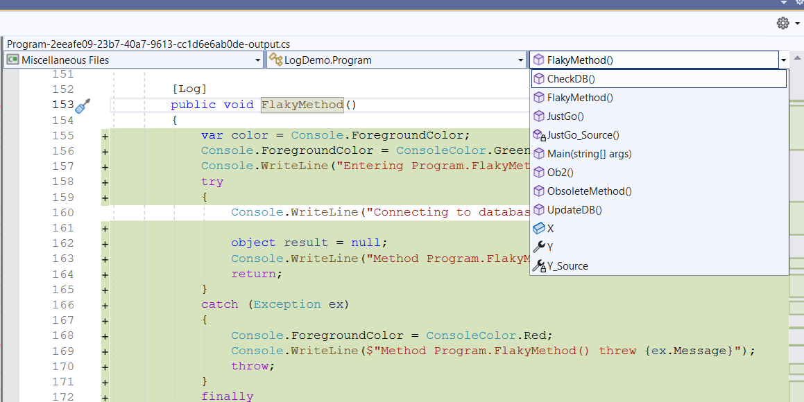

# Understanding your aspect oriented code 

As you apply an aspect you can see the details about that in Code Lense. The following section shows what details Code Lense shows

## Code lens details

As you can see that CodeLense shows the following details 

|Detail | Purpose 
|-------|---------
|Aspect Class | The name of the aspect applied on this target 
|Aspect Target |The fully qualified name of the target 
|Aspect Origin |How the aspect is applied.
|Transformation|This is a default message showing that the aspect changes the behaviour of the target method

Another interesting thing that CodeLense shows is a clickable link to show the aspect modidied code and original code side by side. 

## Previewing generated code 
To preview the change click on that link `Preview Transformed Code` It will show the result like this 

> [!NOTE]
> This preview dialog can also be opened by pressing `Ctrl + K` followed by `0` 

The screenshot shows just the original source of `FlakyMethod` and the modified code by the `[Log]` aspect. However you can see that the command shows the entire file in its original and modified version side by side. 

To see changes for a particular section of the code, select that part of the code from the dropdown as shown below. 

You can also see this from the Context menu that is popped when you right click on the method. The following screenshots shows the highlighted option `Show Metalama Diff`. 

## When you have many aspects?
TODO