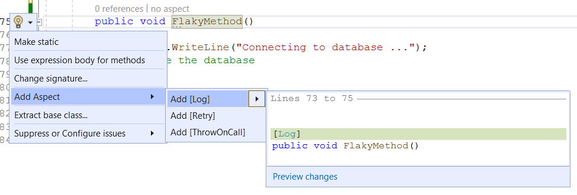

# Adding aspects to your code

Most aspects are custom attributes that have to be applied to some target declaration. Some aspects can target methods, other properties, or classes.

In this section, you'll learn how to use custom attributes to add aspects.

## Adding aspects as custom attributes

Suppose you have a method like this one, which occasionally fails:

At the moment, CodeLens displays `No aspect`. This means that no aspect has been applied to this method yet.

To apply the `Retry` aspect, add it as a normal custom attribute, i.e., type `[Retry]`:

CodeLens now shows `1 aspect`. When you hover your cursor on that text, it will show the following tooltip:

If you want to see the details, click on the text `1 aspect`:

The displayed details are trivial in this example, but this feature will prove itself very useful when you have several aspects on the same methods when aspects are implicitly applied instead of being explicitly applied using a custom attribute.

## Adding more than one attribute

You can choose to add as many aspects as you need on a target method. In this example, if you want to log each retry attempt, you have the option to use the `Log` aspect.

CodeLens now shows that two aspects are applied to the method `FlakyMethod`. If you click on the text `2 aspects`, you can see the details that CodeLens offers:

## Adding aspects via the refactoring menu

Instead of adding attributes manually, you can also do it via the refactoring menu. You can call this menu by clicking on the _lightbulb_ or _screwdriver_ icon, or by pressing `Ctrl + .`.

As you can see, the refactoring menu shows that three different aspects can be applied to this method. If you hover your mouse cursor over a menu item, you will see a preview of your code with the aspect custom attribute.

The refactoring menu is smart enough to know which aspect has already been applied and it changes the recommendations accordingly. The following screenshot shows that after the application of the `Retry` aspect, the refactoring menu only shows the remaining aspects from the project.

> [!NOTE]
> The refactoring menu only displays aspects that are _eligible_ for your code. The eligibility of an aspect is defined by the aspect's author. For instance, it does not make sense to add a caching aspect to a method returning `void`, so the author of this aspect may make it eligible for non-void methods only.

